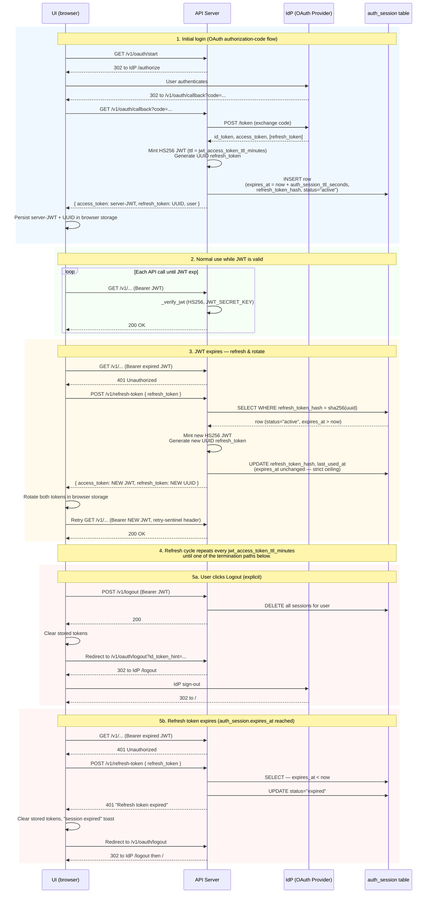

# Auth - Authentication Package

> **Parent**: [packages](../README.md) · **Repo root**: [Repo Root](../../README.md)

Shared authentication package. Provides OAuth-based user authentication, server-issued JWT sessions with refresh-token rotation, role-based access control, and pluggable API-key authentication via shared-secret callbacks. Used by every API server generated from this codebase.

## Table of Contents

- [Overview](#overview)
- [OAuth flow](#oauth-flow)
- [JWT sessions](#jwt-sessions)
- [API-key authentication with shared-secret callback](#api-key-authentication-with-shared-secret-callback)
- [Testing](#testing)
- [Implementation references](#implementation-references)

## Overview

The package supports two authentication paths:

1. **OAuth (interactive)** — users authenticate at an external Identity Provider (any OIDC-compliant IdP) via the matching `AuthProvider` implementation in `src/auth/`. The API server then issues its own short-lived HS256 JWT plus a UUID refresh token; the UI never carries the IdP's tokens after the callback completes.
2. **API key (programmatic)** — clients send an `X-API-Key` header validated either against the global `api_shared_secret` from config (admin access) or against a custom callback (per-client keys, HMAC signatures, service-to-service).

## OAuth flow

The diagram below covers the full session lifecycle: initial OAuth login, the
refresh-and-rotate cycle that keeps the user logged in past the short-lived
access JWT, and both termination paths (explicit logout, refresh-token expiry).



## JWT sessions

Both the password-login path (`/v1/login`) and the OAuth callback issue **server-minted HS256 JWTs** as access tokens, paired with a server-issued UUID refresh token backed by the `auth_session` table. The UI never carries an IdP-issued access token; this lets the API server verify every incoming token locally with `JWT_SECRET_KEY` and decouples session lifetime from the IdP.

### Token lifecycle

| Token | Format | Lifetime | Where it lives |
|---|---|---|---|
| Access token | HS256 JWT, signed with `JWT_SECRET_KEY` | **60 min** default (`jwt_access_token_ttl_minutes`) | UI: browser storage (each app chooses the key it uses) |
| Refresh token | Opaque UUID (random) | **24 h** default (`auth_session_ttl_seconds`) | UI: browser storage; server stores only a SHA-256 hash in `auth_session.refresh_token_hash` |

Access JWT payload (set by `LocalAuthProvider.generate_token`):

```json
{
  "sub": "user@example.com",
  "exp": 1779419599,
  "user": { "id": "...", "email": "...", "roles": [...], "groups": [...] }
}
```

The user dict in the payload excludes `password_hash` and `password_updated_at`.

### Configuration

| Knob | Default | Where | Notes |
|---|---|---|---|
| `JWT_SECRET_KEY` | `fallback_dev_key` | env var, read at import time by `local_auth.py` | Must be a real secret in any non-dev deployment. Shared across replicas. |
| `jwt_access_token_ttl_minutes` | `60` | `ConfigBase` field on every app's runtime settings | Access-token JWT lifetime in minutes. Per-app override via `on_get_jwt_access_token_ttl_minutes(request)` in `event_handlers.py`. |
| `JWT_EXPIRATION_MINUTES` env var | unset | `local_auth._resolve_jwt_expiration_minutes()` | **Local-test override** — set to a small number (e.g. `2`) and restart the API to verify the refresh cycle in minutes instead of hours. Wins only when the hook didn't supply an explicit value. |
| `auth_session_ttl_seconds` | `86400` (24 h) | `ConfigBase` field on every app's runtime settings | Refresh-token **absolute** lifetime (strict, not sliding). Per-app override via `on_get_auth_session_ttl_seconds(request)` in `event_handlers.py`. |
| `auth_session_idle_timeout_seconds` | `1800` (30 min) | `ConfigBase` field on every app's runtime settings | **Sliding** idle timeout — session is invalidated at the next `/v1/refresh-token` call if the previous call was more than this many seconds ago. Any value `< 1` disables the check (only the absolute ceiling above applies). Per-app override via `on_get_auth_session_idle_timeout_seconds(request)`. Disable in apps that hold long-running WebSocket connections without periodic refresh. |

Precedence for access-token TTL (highest first):
1. **`JWT_EXPIRATION_MINUTES` env var** on the API process — local-test escape hatch that wins over everything. server.py always supplies an explicit `ttl_minutes` via the hook, so without env-var-wins-first you'd have no way to short-circuit for testing without touching DB config.
2. Explicit `ttl_minutes=` passed to `generate_token` / `authenticate` (server.py fills this from `on_get_jwt_access_token_ttl_minutes`, which reads `settings.jwt_access_token_ttl_minutes`).
3. Package default (60).

Per-app overrides via the hooks let an app cap lifetimes more aggressively (or disable the idle check entirely) without touching the codegen output:

```python
def on_get_jwt_access_token_ttl_minutes(request: Request | None = None) -> int:
    return 15   # 15-minute JWTs

def on_get_auth_session_ttl_seconds(request: Request | None = None) -> int:
    return 4 * 3600   # 4-hour absolute refresh ceiling

def on_get_auth_session_idle_timeout_seconds(request: Request | None = None) -> int:
    return 0       # disable idle check (e.g. for long-running WebSocket apps)
```

**Effective max idle before logout = `auth_session_idle_timeout_seconds + jwt_access_token_ttl_minutes`** (the JWT lifetime acts as a grace period — the idle check only fires when the JWT expires and the UI calls `/v1/refresh-token`). With defaults: 30 + 60 = 90 min worst case.

### Refresh & rotation

The UI calls `POST /v1/refresh-token` whenever a request returns 401 or when the cached `exp` claim is in the past. On every successful refresh the server:

1. Looks up `auth_session` by `sha256(refresh_token)` (the raw token never touches the DB).
2. Rejects if `status != "active"` or `expires_at` is in the past — **strict, not sliding**. The 24-hour ceiling runs from initial login, not from last use.
3. Mints a new HS256 access JWT (`generate_token(user)`), new UUID refresh token, updates `refresh_token_hash` and `last_used_at` in the same row.
4. Returns `{access_token, refresh_token}` — both rotate every refresh.

`POST /v1/logout` deletes every active `auth_session` row for the user, invalidating any outstanding refresh tokens instantly.

### Client-side dedup

Concurrent 401s on the UI should all await a single in-flight refresh promise so multiple expired requests don't stampede `/v1/refresh-token`. The UI fetch wrapper is responsible for this; see the per-app `refreshToken.ts` (or equivalent) for the reference implementation.

### When you need to change session lifetime

- **Per-deployment refresh ceiling** → set `auth_session_ttl_seconds` in the app's `Config`, or override `on_get_auth_session_ttl_seconds` in `event_handlers.py`.
- **Per-deployment access-JWT lifetime** → set `jwt_access_token_ttl_minutes` in the app's `Config`, or override `on_get_jwt_access_token_ttl_minutes` in `event_handlers.py`.
- **Immediate revocation of a live session** → delete or set `status = "expired"` on the matching `auth_session` row. The access token may still be valid until its `exp`; the next refresh call will fail.

### Verifying the refresh cycle locally (5-minute recipe)

Default 60-min access tokens make end-to-end refresh testing painful. To see the full cycle in minutes:

1. Set `JWT_EXPIRATION_MINUTES=2` in the API process env and restart the API server:
   ```bash
   JWT_EXPIRATION_MINUTES=2
   ```
2. Log in via the UI (full OAuth flow through the IdP).
3. In DevTools → Application → Local Storage (or wherever your UI persists session data), confirm:
   - The stored access token is an HS256 JWT (header `alg: "HS256"`, `sub: <your email>`)
   - The stored refresh token is a UUID
4. Open the DevTools Console and filter for `[refresh]` (or whatever tag your UI fetch wrapper logs under). Click around the app. After ~2 minutes you should see:
   ```
   [refresh] triggered by 401 on GET /v1/...
   [refresh] POST /v1/refresh-token — access token rotation starting
   [refresh] OK — new access token issued, refresh_token rotated (Xms)
   [refresh] retrying original request: GET /v1/...
   ```
5. Both stored tokens should have new values after each refresh (both rotate).
6. After repeated refreshes the user stays logged in until `auth_session.expires_at` (24h default) — verify by setting `auth_session_ttl_seconds=300` in the app's Config record and confirming the user is forced to re-login after 5 minutes of activity even when refresh attempts succeed in the interim.

If you don't see refresh-related logs after the access JWT expires, the refresh path isn't running — likely causes:
- API process wasn't restarted after the OAuth-callback change (still doing IdP-token passthrough)
- UI wasn't rebuilt after its fetch-wrapper / refresh-helper changes
- Stale stored session data from a pre-change login (clear browser storage and log in fresh)

## API-key authentication with shared-secret callback

When a request includes an `X-API-Key` header, the auth system:

1. First checks if a custom validator callback is registered
2. If yes, calls the callback with the API key
3. If the callback returns a user dict, authentication succeeds
4. If the callback returns `None`, falls back to the global `api_shared_secret` check
5. If neither validates, returns 401 Unauthorized

This lets applications layer per-client or per-service authentication on top of (or instead of) the simple global secret.

### Implementing a validator

A validator is a function that takes the API key and returns a user dict (success) or `None` (failure). The user dict must contain at least `id`, `username`, `email`, and `roles`; additional fields are preserved and reach API endpoints via the injected `user` parameter.

```python
# services/api_client_service.py
from typing import Optional

def validate_api_client_secret(secret: str) -> Optional[dict]:
    """Validate an API client by their secret. Returns user dict or None."""
    db = get_database_client()
    if not db:
        return None

    for client_data in db.get_all_items("api_client"):
        if client_data.get("secret") == secret:
            return {
                "id": client_data["id"],
                "username": client_data["name"],
                "email": f"{client_data['id']}@client.internal",
                "roles": client_data.get("roles", ["Search"]),
                "tenant_id": client_data.get("tenant_id"),
                "volume_ids": client_data.get("volume_ids", []),
                "client_id": client_data["id"],
            }
    return None
```

Best practice for the validator:
- Return `None` for invalid keys (never raise — the auth layer handles 401)
- Log warnings for suspicious activity (but never log the secret itself)
- Handle database errors gracefully — return `None` and log

### Registering the callback

Register on app startup once:

```python
# event_handlers.py
from auth import create_auth_dependencies
from your_app.services.client_service import validate_client_secret

def on_startup():
    settings = get_settings()
    auth_deps = create_auth_dependencies(lambda: settings.model_dump())
    auth_deps.set_shared_secret_validator(validate_client_secret)
```

### Using in routes

No extra wiring per route — the callback integrates with the existing role-based dependencies:

```python
from fastapi import APIRouter, Depends
from auth import create_auth_dependencies

auth_deps = create_auth_dependencies(config_provider)

@router.get("/search")
def search(
    query: str,
    user: dict = Depends(auth_deps.require_role(["Search", "Admin"])),
):
    tenant_id = user.get("tenant_id")
    volume_ids = user.get("volume_ids", [])
    ...
```

Clients call:
```bash
curl -H "X-API-Key: supersecret" https://api.example.com/v1/search?query=test
```

### Use cases

- **Per-client API keys**: store `SearchClient` records with unique secrets, scoped to specific tenants and volumes
- **HMAC authentication**: validate HMAC signatures by recomputing them in the callback against the request body
- **Service-to-service**: a lookup table mapping known service keys to fixed role sets

### Security considerations

1. **Storage**: hash secrets in the database; never store plaintext
2. **Rate limiting**: apply per `client_id` from the returned dict
3. **Rotation**: provide an API endpoint for clients to rotate their secrets
4. **Logging**: log authentication attempts (success and failure) but not the secrets themselves
5. **Expiry**: add expiration dates to API keys and check them in the validator

### Migration from a global-only secret

The global `api_shared_secret` continues to work as a fallback when a callback is registered. To migrate:

1. Register a per-client validator alongside the existing global secret
2. Gradually issue per-client keys
3. Monitor usage of the global secret (log calls that fall through to it)
4. Remove `api_shared_secret` from config once usage drops to zero

## Testing

```python
def test_api_key_auth(client):
    # Valid key
    response = client.get("/v1/search?query=test", headers={"X-API-Key": "valid_secret"})
    assert response.status_code == 200

    # Invalid key
    response = client.get("/v1/search?query=test", headers={"X-API-Key": "invalid_secret"})
    assert response.status_code == 401

    # No key at all
    response = client.get("/v1/search?query=test")
    assert response.status_code == 401
```

## Implementation references

- `src/auth/auth_util.py` — core auth-dependency machinery and callback registration
- `src/auth/factory.py` — `get_auth_provider()`; dispatches to one of the `*AuthProvider` implementations in `src/auth/` based on the `auth_type` config value (`local`, `okta`, `cognito`, `none`)
- `src/auth/local_auth.py` — JWT mint (`generate_token` / `authenticate`) and verify (`_verify_jwt`); HS256 with `JWT_SECRET_KEY`; access-TTL resolution in `_resolve_jwt_expiration_minutes`
- `packages/models/src/models/config_base.py` — `jwt_access_token_ttl_minutes` and `auth_session_ttl_seconds` field declarations
- `packages/models/sql/auth_session.sql` — refresh-session table schema (`refresh_token_hash`, `expires_at`, `last_used_at`, `status`)
- `apps/<app>/src/<app>/server.py` (managed) — `/v1/login`, `/v1/refresh-token`, `/v1/logout`, OAuth callback session creation
- `apps/<app>/src/<app>/event_handlers.py` (unmanaged) — `on_get_jwt_access_token_ttl_minutes(request)` and `on_get_auth_session_ttl_seconds(request)` override hooks, plus the shared-secret callback registration in `on_startup`
- `apps/<app-ui>/lib/refreshToken.ts` (or equivalent per UI) — concurrency-deduped client-side refresh helper
